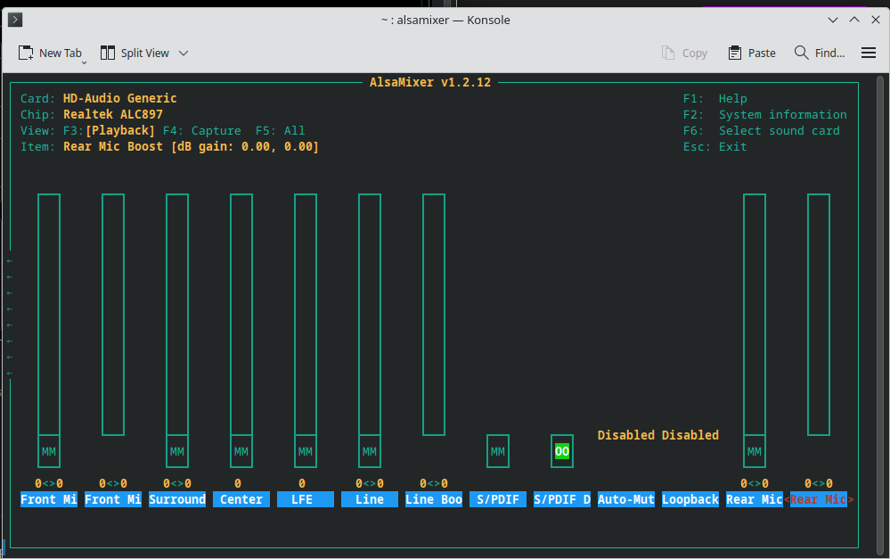

# How to fix auto mute for front panel
* [https://askubuntu.com/questions/131857/alsamixer-howto-disable-auto-mute-mode](https://askubuntu.com/questions/131857/alsamixer-howto-disable-auto-mute-mode)
* or TLDR - run `alsamixer` and disable `Auto Mute` and then run `sudo alsactl store`

