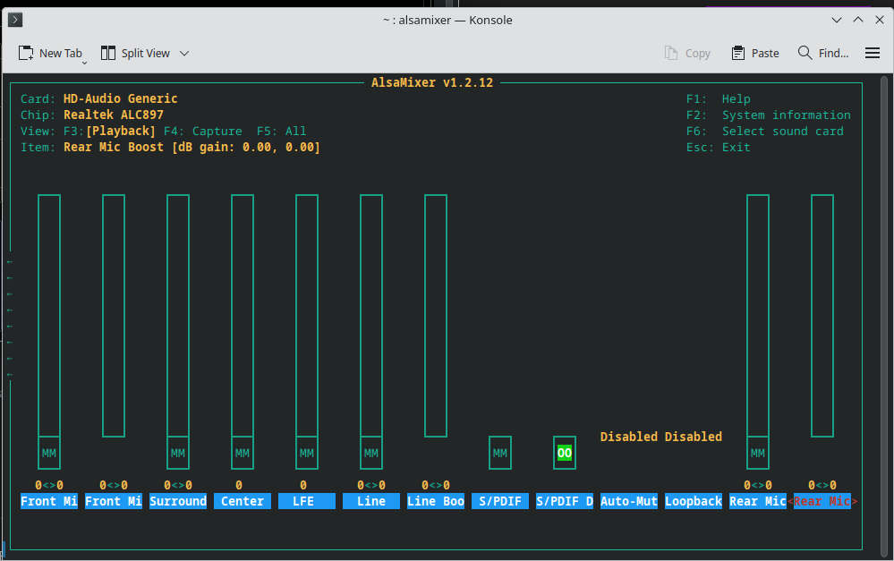

# How to fix auto mute for front panel
* [https://askubuntu.com/questions/131857/alsamixer-howto-disable-auto-mute-mode](https://askubuntu.com/questions/131857/alsamixer-howto-disable-auto-mute-mode)
* or TLDR - run `alsamixer` and disable `Auto Mute` and then run `sudo alsactl store`



# How to fix audio cracking
* Create a directory in `$HOME/.config/wireplumber/wireplumber.conf.d` (create both `wireplumber` and `wireplumber.conf.d` if missing)
* Create a file `01-disable-suspension.conf` with the following content:
```text
monitor.alsa.rules = [
  {
    matches = [
      {
        # This matches all ALSA devices
        node.name = "~alsa_output.*"
      }
    ]
    actions = {
      update-props = {
        session.suspend-on-idle = false
      }
    }
  }
]
```
* Then to disable the driver power savings use `lsmod | grep snd` to see what device you have (most of the motherboards are with `snd_hda_intel`)
* Create a file in `/etc/modprobe.d` (example: `/etc/modprobe.d/snd_hda_intel_no_powersave.conf`) with the following content
```text
options snd_hda_intel power_save=0 power_save_controller=N
```
and restart your PC.