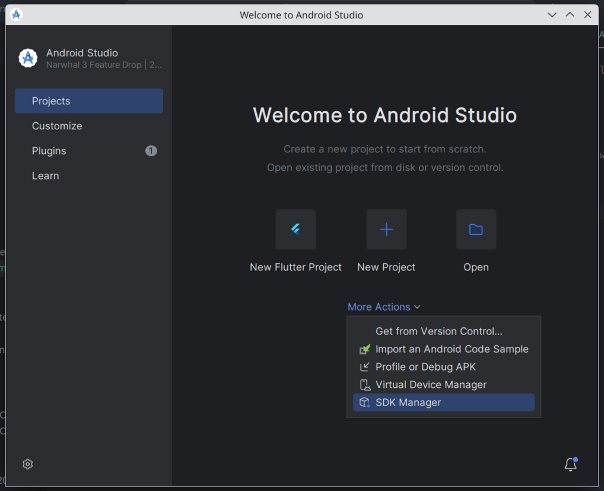
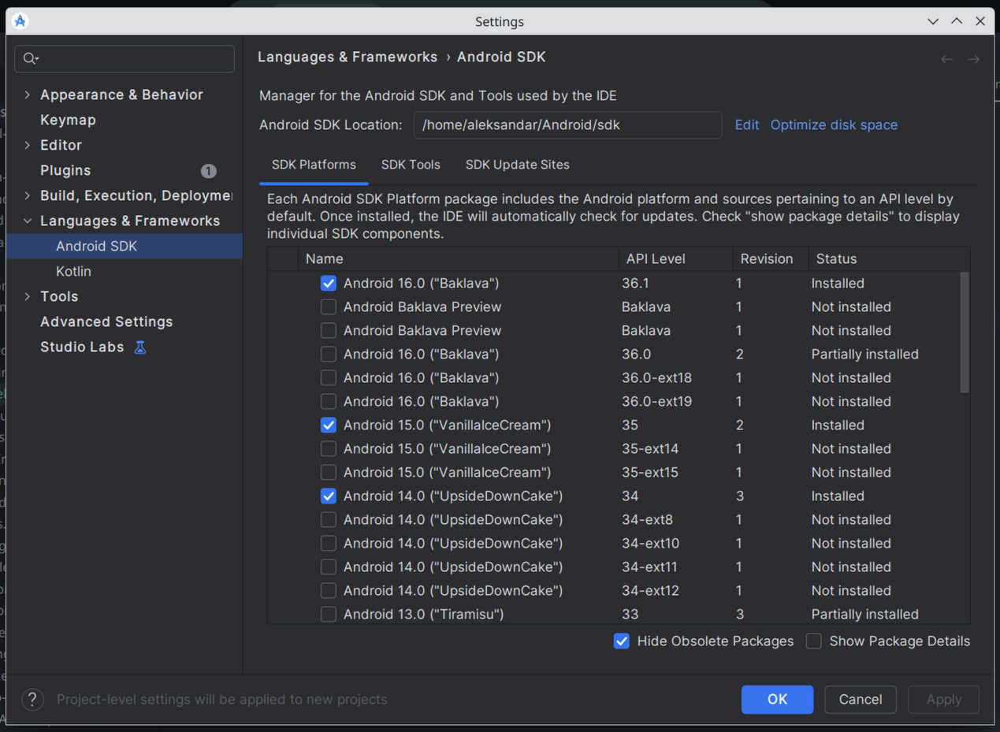
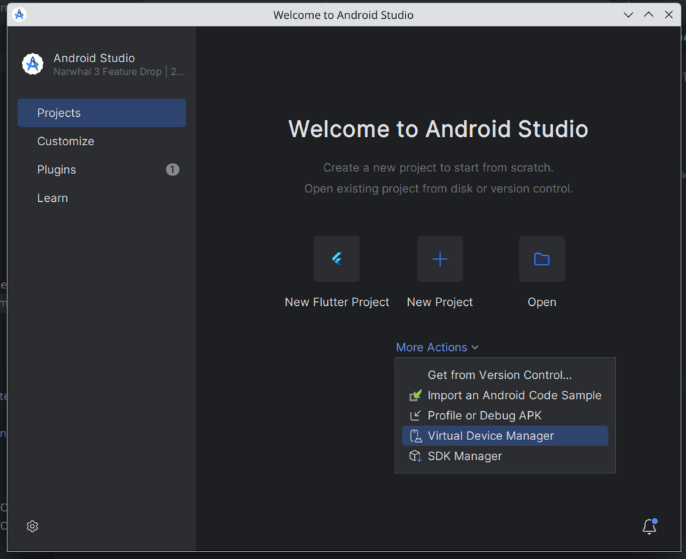
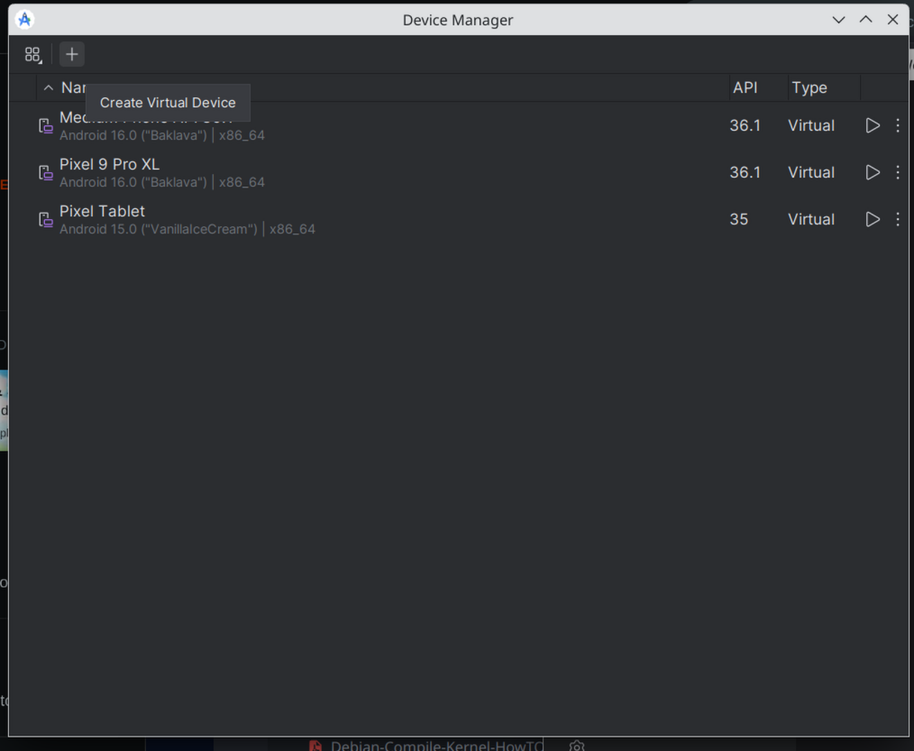

# Update your shell's user configuration (in my case `.bashrc` file) with the following:
```bash
# Android
export ANDROID_HOME="$HOME/Android/sdk"
export PATH=$PATH:"$ANDROID_HOME/cmdline-tools/latest/bin"
export PATH=$PATH:"$ANDROID_HOME/platform-tools"
export NDK_HOME="$ANDROID_HOME/ndk/28.2.13676358" # point it to the version you will install below
```
# Download and extract `Android Studio`
# Open it
# Point the location to Android SDK to the folder above:




# Download and install whatever you need

# To use Android Virtual Devices:


