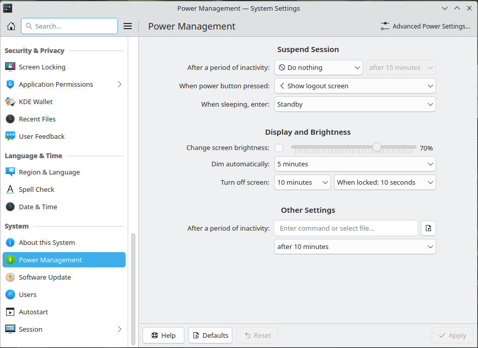

# Installation
* Download minimal ISO and install `Fedora KDE Plasma Workspace`. Remove checkboxes for everything in the `Additional software` tab, select then only `RPM Development Tools` and `System Tools`.

# After installation of Fedora

## Clone `update-fedora` repo [https://github.com/AleksandarBayrev/update-fedora](https://github.com/AleksandarBayrev/update-fedora) and run `make install`, use the script  to update the system

## Add Flathub repository

## Remove zram-generator (if using a separate swap partition)
* Run `sudo dnf remove zram-generator-defaults zram-generator`

## Disable SELinux - edit `/etc/selinux/config` file, find line `SELINUX=` and set it to `disabled` => `SELINUX=disabled`

## Check `Swap-File-Creation.md`

## For NVIDIA - install `akmods-nvidia`, run `sudo akmods-shutdown` and edit `/etc/default/grufb` to add parameter `nvidia-drm.modeset=1` and then run `sudo grub2-mkconfig -o /boot/grub2/grub.cfg`

## Setup sysctl swappiness
* Create `10-swappiness.conf` with contents `vm.swappiness=10` in `/etc/sysctl.d`

## Remove abrt
* Run `sudo dnf remove abrt*`

## Install firmware
* Check `Linux-Firmware-For-Hardware.md`

## Install firewall-config
* Run `sudo dnf install firewall-config`

## Install codecs
* Run `sudo dnf swap ffmpeg-free ffmpeg --allow-erasing`

## Base tools
* Install groups `Multimedia` (not needed if you use Flatpak apps for Multimedia [Firefox, VLC, etc...]), `Development Tools` via `sudo dnf group install YOUR_GROUP`
* Install `rpmconf`, `dnf-plugin-system-upgrade` and `remove-retired-packages`
* Install `corectrl` (for AMD GPU users), `nvtop` (for GPU monitoring)

## Flatpaks
* `Flatseal`, `Firefox`, `Postman`, `OBS Studio`, `Viber`, `Handbrake`, `ProtonUp-Qt`, `MediaInfo`, `PCSX2`, `Duckstation`, `GIMP`, `Kdenlive`, `Inkscape`, `KDiff3`, `OpenMW`, `PPSSPP`, `qBittorrent`, `Remmina`, `VLC`, `Lutris`, `Apache JMeter`, `Vencord`, `Avidemux`, `Bottles`, `RPCS3`, `Filezilla`, `Audacity`, `LibreOffice`, `DBeaver`, `Heroic Games Launcher`, `gamescope from org.freedesktop.Platform.VulkanLayer.gamescope`
* Check app-order-linux.png from `random-important-stuff` repo.

## How to update
* Run `sudo dnf upgrade --refresh && sudo akmods-shutdown` (call `sudo akmods-shutdown` only if you use some sort of akmods (NVIDIA drivers, VirtualBox))
* Or run `update-fedora` bash script (copy it to `/usr/sbin`). It does everything automatically.

## How to upgrade
* Install `system-upgrade` using the command `sudo dnf install dnf-plugin-system-upgrade`
* Use the command like this `sudo dnf system-upgrade download --releasever=YOUR_VERSION` (eg. `sudo dnf system-upgrade download --releasever=37`)
* After the update has been downloaded - `sudo dnf system-upgrade reboot` and wait for the operation to complete.

## After upgrade
* Run `sudo remove-retired-packages YOUR_PREVIOUS_VERSION` to remove old packages not needed after the update. 
* Run `sudo rpmconf -a` to update RPM configurations after upgrade.
 
## After kernel upgrade
* It is recommended after running `dnf update` to run `sudo akmods-shutdown` to rebuild kernel modules and then reboot (mainly NVIDIA users are affected) (update-fedora script automatically does this).

## Running in VMware
* Issue noticed on Fedora 37 - sound is choppy, to resolve it: `sudo dnf install pulseaudio --allowerasing`

## For NVIDIA Users
* Install `envycontrol` to switch between graphics cards.
* Check `NVIDIA-Fixes-Linux.md`

## For KDE
* Disable indexing in `File Search` if you experience stutter after installing apps.
* Set `Start with an empty session` in `Settings -> Session -> Desktop Session`
* Remove all bindings to screen edges in `Settings -> Mouse & Touchpad -> Screen Edges`
* Set default path in `Dolphin` file manager to home folder

## For Multimedia (FFmpeg/Mesa) from RPMFusion check this - [https://rpmfusion.org/Howto/Multimedia](https://rpmfusion.org/Howto/Multimedia)

## For Lutris - `flatpak install org.freedesktop.Platform.VulkanLayer.gamescope/x86_64/23.08`

## If you have system-wide hangs without internet - `sudo dnf reinstall linux-firmware`

## *OPTIONAL* (if you don't use flatpaks): Install Mesa from RPMFusion - `sudo dnf swap mesa-*-drivers mesa-*-drivers-freeworld.* --allowerasing`

## For Discord - install `Vencord Desktop` from github - [https://github.com/Vencord/Vesktop/](https://github.com/Vencord/Vesktop/)

## Check `fedora-dnf-history.log` for some tips about installing/removing initially.

## Check `Fix-Linux-Sleep.md` (should not be relevant with newer kernels)

## Customize power profiles

## Check `Flatpak-Apps.md`, `fedora-flatpaks.txt` and `fedora-packages.txt` for apps that I might have missed.

## Check `QEMU-KVM.md` to see how to setup QEMU/KVM.

## IMPORTANT!!! - Install `Steam` via `distrobox` - check `Steam-Distrobox.md` on how to setup the container.

## Install glmark2 and s-tui to perform GPU/CPU stress tests.