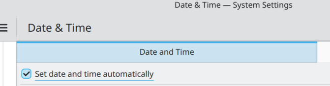

# Install latest Fedora - either immutable or mutable

# !!! IMPORTANT !!! - check `Hostname-Important-Info.md`

# IMPORTANT!!! - Don't forget to enable `Set Date/Time Automatically` in KDE Settings in Date & Time



# IMPORTANT!!! - [ NOTE - it could be obsolete by the time it releases, since the plans are to integrate dnf5 and bootc to replace rpm-ostree ] When Fedora migrates to `bootc` please check`Fedora_Bootc_Migration_Guide.pdf` (of course run it through an AI/check documentation manually since commands could be changed)

# IMPORTANT!!! - If you choose the immutable variant read the whole document!

## IMPORTANT!!! - to edit kernel arguments use `ostree kargs --editor` if using an immutable distro

## IMPORTANT!!! - if using an immutable distro with distrobox - install `Podman Desktop` via flatpak

## IMPORTANT!!! - If you use an immutable distro - disable automatic updates (if in KDE it is done via the GUI, check `KDE-Settings.md`), use `update-fedora` script or manually update via `rpm-ostree` (`--preview` to check changes, `upgrade` to update)

## IMPORTANT!!! - If you're on an immutable distro and have a NVIDIA GPU - read through `RPMFusion-Immutable-HowTO.md` file on how to setup RPMFusion correctly.

## IMPORTANT!!! - If you are going to use an immutable variant - create 4GiB for /boot/efi (EFI System partition) and 8GiB for /boot (ext4), rest of the drive should be btrfs. It is recommended to have a separate drive for the OS!

## IMPORTANT!!! - If you use the immutable variant and you want to use gamescope and mangohud inside a distrobox container check `Apps-In-Distrobox.md`

## IMPORTANT!!! - If you use the immutable variant - check `Fedora-Immutable-Groups-Fix.md` file on how to fix groups not working when using `usermod -aG` command

## IMPORTANT!!! - If you use the immutable variant - `rpm-ostree` and `ostree` are your most important commands, check them thoroughly!

## IMPORTANT!!! - If you use the immutable variant - the default grub timeout is 1 second, to update it create a `/boot/grub2/user.cfg` file with the following content: `set timeout=YOUR_TIMEOUT`, example: `set timeout=5` for 5 seconds

## IMPORTANT!!! - If using a laptop, check `cpupower-Fixes.md`

## Use `rpm -qa` to show all installed packages on immutable variants.

## Enable `ntsync`, check `NTSYNC-HowTO.md`

## IMPORTANT!!! - If on Wi-Fi, check `NetworkManager-Linux-WiFi-Powersave.md`

## If you run a Thinkpad with a fingerprint scanner check `Thinkpad-Fingerprint-Scanner-Linux-HowTO.md`
# IMPORTANT!!! - Add flathub if you use flatpaks `flatpak remote-add --if-not-exists flathub https://dl.flathub.org/repo/flathub.flatpakrepo`
# IMPORTANT!!! - Disable CSM in UEFI/BIOS since it interferes with `ReBAR` (Resizable BAR), it can't be enabled, which has huge performance penalty when OFF
# IMPORTANT!!! - Add a root password after installation of the OS in order to have `sudo` cofigured out-of-the-box after installation instead of adding your current user to `sudo` group
# IMPORTANT!!! - by default install recommendation for Lutris/Steam is via flatpak on immutable Fedora (Silverblue, Kinoite), but I would recommend if you decide to install to use mesa-custom-launcher - definitely check `Apps-In-Distrobox.md` - you should use a container for Steam/Lutris if you want custom Mesa drivers, don't forget to upgrade the containers after a system upgrade
# If you want to use snapshots before update - install the OS to a btrfs formatted drive (best way to do it is to have a separate SSD for OS only), and then use btrfs-assistant, check guides on how to setup dnf for automatic snapshots
# Disable SELinux - edit `/etc/selinux/config` file, find line `SELINUX=` and set it to `disabled` => `SELINUX=disabled` (or use `grubby --update-kernel ALL --args selinux=0` )or if running an immutable distro `rpm-ostree kargs --editor` and append `selinux=0`)
# Delete java (`sudo dnf remove java*`), zram-generator (`sudo dnf remove zram-generator*`), dragon (`sudo dnf remove dragon`), elisa-player (`sudo dnf remove elisa-player`), ktorrent (`sudo dnf remove ktorrent`) or override in rpm-ostree
# Install `kernel-modules-extra` for additional device support (install via rpm-ostree on immutable system)
# Check `ALSA-Fixes.md`
# Check `KDE-Settings.md`, disable auto updates (it is described there how)
# Install `kernel-tools` package and use `turbostat` command to monitor CPU stats
# Install `rpmconf` to manage configurations after a system upgrade
# Check `mesa-custom-builds` when you need to run a newer Mesa version
# Add user to `flatpak`, `libvirt`, `kvm` groups, then run `newgrp` to update them
# Check `Fix-Linux-Sleep.md` to disable hibernation or try to potentially fix some issues.
# Packages to overlay in immutable system - `distrobox fastfetch gnome-disk-utility libvirt qemu virt-manager btop nvtop fuse fuse-libs lm_sensors edk2-ovmf edk2-tools`, check others below if you need something else
# Check `config-fastfetch/README.md` for fixing monitor detection
# Packages to remove via rpm-ostree override remove - `zram-generator zram-generator-defaults firefox firefox-langpacks`
# To check what packages are going to be upgraded - `rpm-ostree upgrade --preview`
# To update the system on immutable system - `sudo rpm-ostree upgrade`
# To update the system on mutable system - `sudo dnf update`
# Upgrade system process on immutable system:
* It is recommended to upgrade the current system first to the latest version with `sudo rpm-ostree upgrade`, reboot and pin the deployment with `sudo ostree admin pin DEP_INDEX` (most probably 0, or 1 if you want to pin the previous deployment)
* Then run `ostree remote refs fedora | grep -i ARCH/FLAVOR`, where `ARCH` is your architecture (most likely x86_64) and `FLAVOR` is `silverblue`, `kinoite`, etc. It will give you a list of possible versions, example for `ostree remote refs fedora | grep -i $(uname -m)/kinoite`:
```text
fedora:fedora/35/x86_64/kinoite
fedora:fedora/36/x86_64/kinoite
fedora:fedora/37/x86_64/kinoite
fedora:fedora/38/x86_64/kinoite
fedora:fedora/39/x86_64/kinoite
fedora:fedora/40/x86_64/kinoite
fedora:fedora/41/x86_64/kinoite
fedora:fedora/42/x86_64/kinoite
fedora:fedora/43/x86_64/kinoite
fedora:fedora/44/x86_64/kinoite
fedora:fedora/rawhide/x86_64/kinoite
```
* Then run `sudo rpm-ostree rebase fedora:fedora/NUMBER_HIGHER_THAN_THE_CURRENT_ONE/YOUR_ARCH/FLAVOR`, example: `sudo rpm-ostree rebase fedora:fedora/44/x86_64/kinoite`
# Upgrade system process on mutable system:
```bash
sudo dnf system-upgrade download --releasever NUMBER_HIGHER_THAN_THE_CURRENT_ONE
sudo dnf system-upgrade reboot
# After the upgrade run
sudo rpmconf -a # to reconfigure new applications, not needed for rpm-ostree
```
# Install security tools `firewalld` (if not present), `chkrootkit`, `rkhunter`
# Install `net-tools` for the `netstat` command and other tools
# Install `pkexec` for GUI authorization
# Install `fastfetch` and check `config-fastfetch/README.md`
# Install `flatpak`, `libspa-0.2-bluetooth`, `sbc-tools`, `freeaptx-utils`, `bluetooth`, `galternatives`, `vlc`, `synaptic`, `wayland-protocols`, `pipewire`, `htop`, `btop`, `vim`, `openjdk-*-jre`, `libsdl2-dev`, `libcurl4-gnutls-dev`, `libopenal-dev`, `firewall-config`, `stress`, `s-tui`, `soundkonverter`, `rar`, `unrar`, `usbutils`, `smartmontools`, `nvme-cli` and `qt6-wayland` (if needed, and if possible in a distrobox container)
# Install `bash-completion` for bash autocomplete if missing
# Install `nvtop` if you have a NVIDIA GPU
# Flatpaks: check `flatpaks-to-install.txt` (important: check this file every time you reinstall! (DBeaver for example is important when you use SQLite for example))
# Install `Thumbnail Grid` task switcher for KDE (if missing).
# Install `clinfo` to show display system info.
# Install `acpi` to check battery status (on laptops)
# Install `upower` to check battery status (on laptops) and enable `upower` service
# Use [https://github.com/AleksandarBayrev/ttf-fonts-installer/](https://github.com/AleksandarBayrev/ttf-fonts-installer/) to add Microsoft fonts
# Install `KSystemLog` to view logs (install via rpm-ostree on immutable system)
# Check `Gaming-Linux-HowTO.md` for gaming
# Check `KDE-Settings.md` for some settings if you use KDE
# Check `Gaming-Software.md`
# Install `rocm-smi` if you want to have GPU temps in `btop`
# To enable automatic time sync install `systemd-timesyncd` (check if needed, and probably another package name)
# IMPORTANT!!! - check with `apt-mark showhold` any hold package versions and unhold them before upgrading!
# For AMD GPUs - check `AMD-GPUs-Linux-Control-Panel.md`
# For NVIDIA GPUs - after updating via the `update-fedora` script, if the GPU does not have drivers run in recovery mode and run `sudo akmods --force`, this applies only to non-immutable OSes
# Install `linux-headers-$YOUR_ARCH cmake make gcc g++ flex bison clang gcc-multilib g++-multilib autoconf automake build-essential` for development purposes
# IMPORTANT!!! - for pipewire - Ensure this continues working after a reboot. If not, you may need to "mask" the PulseAudio service by running:
* `systemctl --user mask pulseaudio`
# To check if pipewire is being used: `LANG=C pactl info | grep '^Server Name'`
# Install firmware
* Check `Linux-Firmware-For-Hardware.md`
# Check `Sound-Fixes-Linux.md` as well.
# Check `Disable-USB-Autosuspend-Linux.md`
# Check `Mediatek-WiFi-Debian.md` for instructions on how to setup firmware (if you have problems)
# Check `Apps-In-Distrobox.md`
# For using `OpenVPN` configuration check `OpenVPN-Configuration-Linux.md`
# If using APC UPS - check `Linux-UPS-APC-HowTO.md` (install via rpm-ostree on immutable system)
# Install `fooyin` for listening to music (use flatpak)
# Check `NTSYNC-HowTO.md`
# If you want to use gamescope - check `gamescope-installer` folder and `Gamescope-Notes.md` in `random-important-stuff`
# Check `Linux-Gaming-Notes.md` in `random-important-stuff` for useful tips mostly for old games (to limit CPU cores for example)
