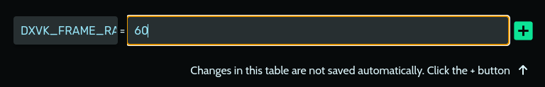
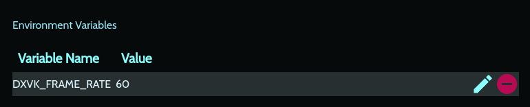

# If you need only FPS limiter for games - use this as advanced options (Game settings -> Advanced -> Environment Variables)- `DXVK_FRAME_RATE=YOUR_FPS`

## After you add it it should look like this

