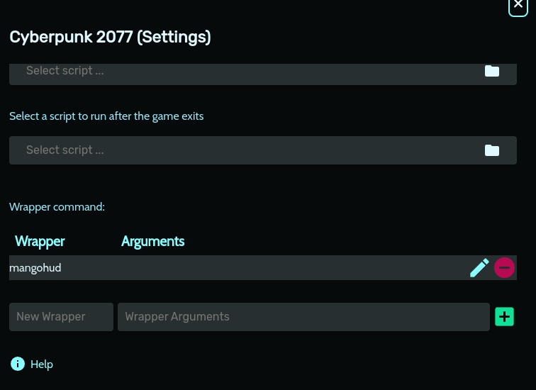

# To use `mangohud` in `Heroic Games Launcher` install all of the packages from `flatpak`: `runtime/org.freedesktop.Platform.VulkanLayer.MangoHud/x86_64/VERSION`
# Use it like this for each game: (`Game Settings` -> `Advanced`)
* 