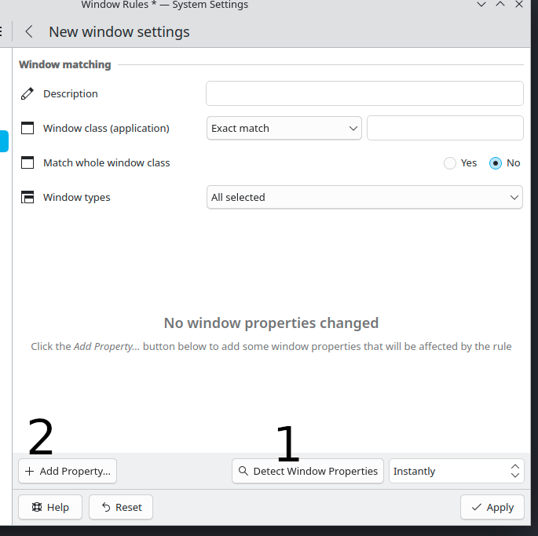
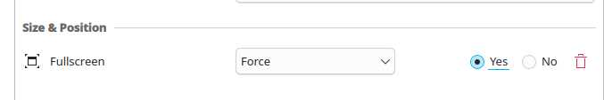

# Open `Window Rules`
# Click on `Add New`
# Click on `Detect Window Properties`
# Select your window via the cursor that appeared
# Click on `Add Property` and select `Fullscreen`

# `Force` the `Fullscreen` and click apply

