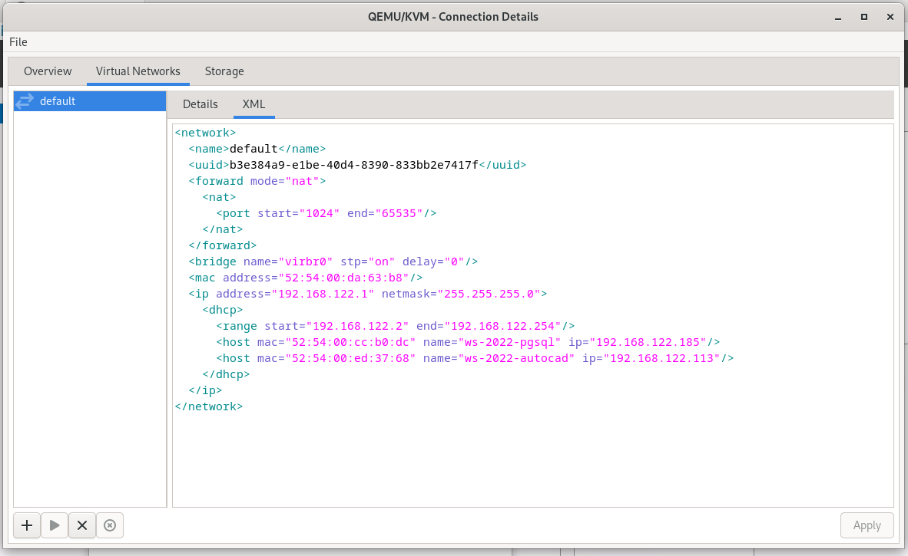

# To set static IP on the machines via DHCP server from KVM use the network configuration of KVM/QEMU
* Add a host entry like this:
```xml
<host mac="guest-mac-address" name="guest-identifier-eg-kvm-machine-name" ip="desired-ip-addres-in-range-above" />
```

* Restart the network