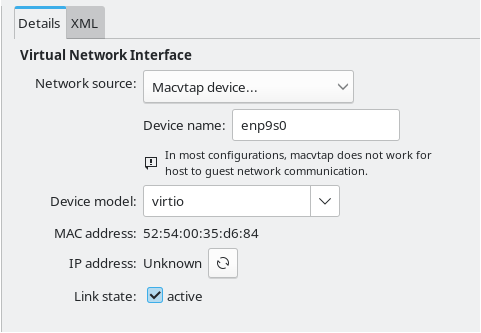
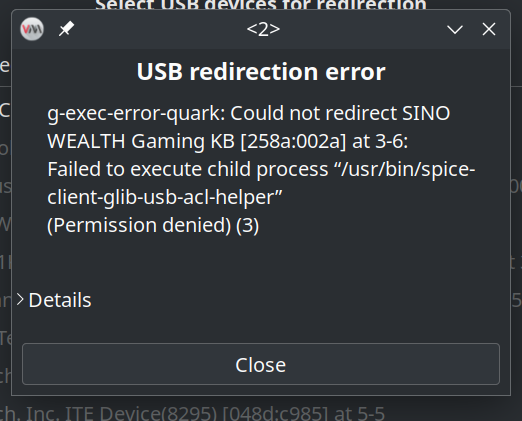

# QEMU/KVM Tips
* Install `qemu-full` `libvirt` `virt-manager` `dnsmasq` `swtpm` for optimal compatibility.
# After installation run `sudo systemctl enable --now libvirtd`

# For Fedora install `Virtualization` group

# Note - if you want to use bridge networking do this
* Set your device name (get it from the terminal via `ip addr` for example)

# If there is such error appearing while trying ot pass through an USB device:

* Do this: `sudo usermod -aG libvirt,qemu,kvm $YOUR_USER` and reboot