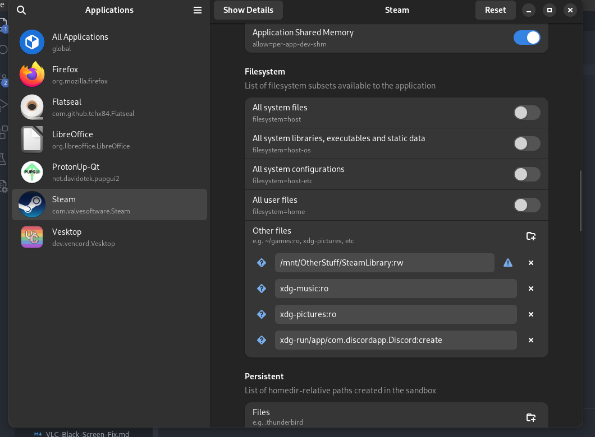

# DISCLAIMER - obsolete, use `distrobox` with `opensuse/tumbleweed` image, it is better experience when you need to use tools such as `libstrangle`
# Install `steam` from flatpak
# Install `protontricks` from flatpak
# Install `flatseal` from flatpak
# Set up your path like that - `/mnt/OtherStuff/SteamLibrary:rw` where `:rw` specifies read and write
# Choose download region different from Bulgaria, in my tests the best results were from Germany
# IMPORTANT!!! - If you use an external SSD for example - edit the mount point to `/mnt/MY_HDD` instead of `/run/media/YOUR_USERNAME` to have `Flatseal` work correctly with permissions!
# If you need only FPS limiter for games - use this as advanced options - `DXVK_FRAME_RATE=YOUR_FPS %command%`
# How to setup `libstrangle` for Flatpak - `Steam-libstrangle-Flatpak.md` OR use MangoHud - `Steam-mangohud-Flatpak.md` (MangoHud recommended)
# Disable shader pre-cache in `Settings -> Downloads`
# If a controller is not detected - right click on the game -> `Properties -> Controller -> Switch Disable/Enable` and check if it works.            

