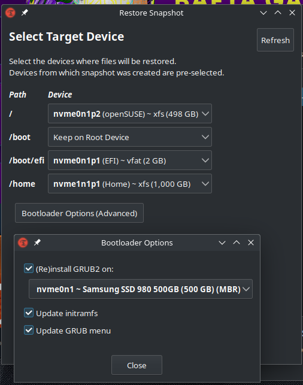
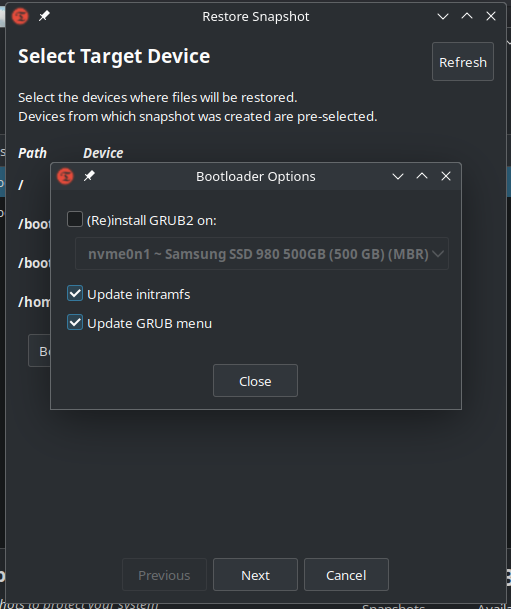

# Use it to do incremental system backups.
# Create an image with the create button, don't backup `/home` or `/root`, or external drives
# To restore see this - make sure you check `update initramfs` to be good. You don't need to check `(Re)Install GRUB2` option if GRUB is already working.

# IMPORTANT!!! - it is recommended to do a restore from a Live CD - use any distro and install `Timeshift` and `cron` and proceed with the restore.
# IMPORTANT!!! - if you use `/swapfile` mapped to `/` (root), it will not be backed up, so if you restore the system on a new drive please recreate the file (check `Swap-File-Creation.md` file)