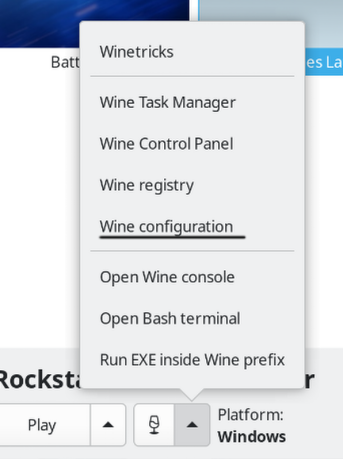
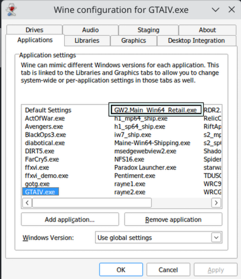
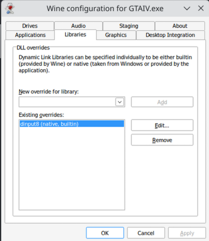

# If you want to do DLL overrides per app (in Lutris for example)
* Open the specific app wine configuration

* Add the executable that you launch (in this case GTA IV)

* Override the required DLLs (in that case required for FusionFix)

