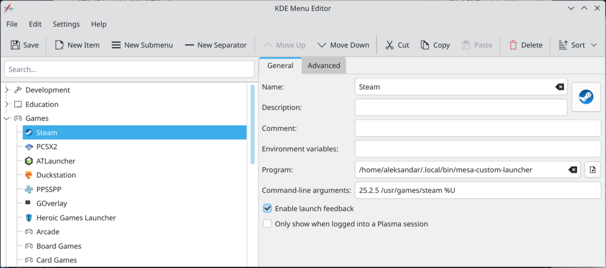
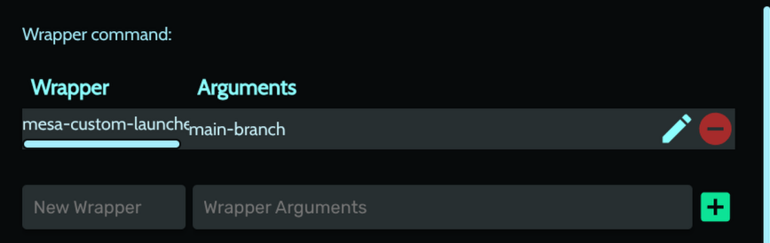

# To build `Mesa` from source do this:
* Check prerequisites [here](https://docs.mesa3d.org/install.html)
* Download the release
* Unarchive the release and open it in a terminal
* Recommended: use `distrobox` to create containers (for both 32 and 64-bit Mesa libraries) to compile the source and then remove it in order not to bloat your main system with stuff that you don't need globally
```sh
distrobox create --image fedora:44 --name fedoramesacompile# For the 64-bit
```
* You are going to use [mesa-custom-launcher](https://github.com/AleksandarBayrev/mesa-custom-launcher), use the example compiling command to put the version in the correct folder (create `$HOME/.mesa-custom` if it does not exist beforehand)
* Enter the newly created container
* Install some prerequisites: `sudo dnf group install development-tools` and `sudo dnf install gcc gcc-c++ meson ninja-build git` and `sudo dnf install libstdc++-devel.i686 libstdc++-static.i686 libstdc++-devel.x86_64 libstdc++-static.x86_64` and `sudo dnf install libglvnd-devel.i686 libva-devel.i686 llvm-devel.i686 rust-std-static-i686-unknown-linux-gnu` and `sudo dnf install libclc-devel.* libatomic.* libdrm-devel.* libpciaccess-devel.* llvm-devel.* clang-devel.* systemd-devel.* rust-bindgen-devel.*`
* Install Mesa build dependencies (`sudo dnf builddep mesa`)
* Create crosscompile.ini file with the following contents:
```ini
[binaries]
c = ['gcc', '-m32']
cpp = ['g++', '-m32']
rust = ['rustc', '--target', 'i686-unknown-linux-gnu']
ar = 'ar'
strip = 'strip'
pkg-config = 'pkg-config'
llvm-config = '/usr/bin/llvm-config'

[properties]
# This tells Meson that your 64-bit OS can run 32-bit build tools natively!
needs_exe_wrapper = false

[host_machine]
system = 'linux'
cpu_family = 'x86'
cpu = 'i686'
endian = 'little'
```
* Run `meson subprojects update` to update the dependencies for 64-bit
* Run `meson setup builddirx64 --libdir lib64 --prefix=$HOME/.mesa-custom/mesa-version -Dgallium-drivers=all -Dvulkan-drivers=amd,intel,swrast -Dgallium-rusticl=true -Dllvm=enabled -Dvideo-codecs=all -Dbuildtype=release` (change --prefix to your folder) (for 64-bit Mesa)
Example if compiling mesa 25.2.4: `meson setup builddirx64 --libdir lib64 --prefix=$HOME/.mesa-custom/25.2.4 -Dgallium-drivers=all -Dvulkan-drivers=amd,intel,swrast -Dgallium-rusticl=true -Dllvm=enabled -Dvideo-codecs=all -Dbuildtype=release`
* Run `meson subprojects update` to update the dependencies again for 32-bit
* Run `meson setup builddirx32 --cross-file crosscompile.ini --libdir lib --prefix=$HOME/.mesa-custom/mesa-version -Dgallium-drivers=all -Dvulkan-drivers=amd,intel,swrast -Dgallium-rusticl=true -Dllvm=enabled -Dvideo-codecs=all -Dbuildtype=release` (change --prefix to your folder) (for 32-bit Mesa)
Example if compiling mesa 25.2.4: `meson setup builddirx32 --libdir lib --prefix=$HOME/.mesa-custom/25.2.4 -Dgallium-drivers=all -Dvulkan-drivers=amd,intel,swrast -Dgallium-rusticl=true -Dllvm=enabled -Dvideo-codecs=all -Dbuildtype=release`
* Run `meson compile -C builddirx64` to compile it (64-bit)
* Run `meson compile -C builddirx32` to compile it (32-bit)
* Run `meson install -C builddirx64` to install it to the prefix (64-bit libraries)
* Run `meson install -C builddirx32` to install it to the prefix (32-bit libraries)
* Exit the container
* Add in `.bashrc` after all path updates the line `export PATH=$PATH:~/.local/bin`
* Use [mesa-custom-launcher](https://github.com/AleksandarBayrev/mesa-custom-launcher) like this: `mesa-custom-launcher YOUR_MESA_VERSION your_app [...your_args]` to point to the newer `Mesa`
* Or edit your application entries (for KDE an example with KDE Menu Editor):


* Or add it to the `Steam` launch options for example directly: `mesa-custom-launcher my-version %command%`
* For `Heroic Games Launcher` per game override use the `Wrapper command` in `Properties` -> `Advanced`:
