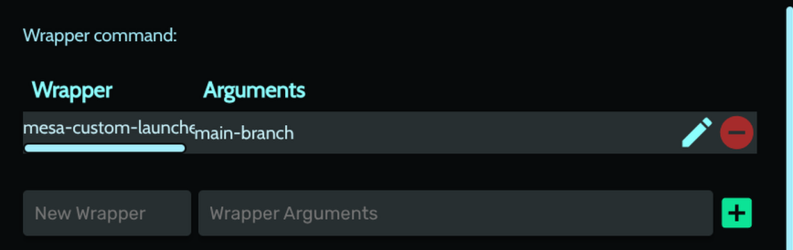

# To build `Mesa` from source do this:
* Check prerequisites [here](https://docs.mesa3d.org/install.html)
* Download the release
* Unarchive the release and open it in a terminal
* Recommended: use `distrobox` to create containers (for both 32 and 64-bit Mesa libraries) (whether Debian/Fedora/openSUSE) to compile the source and then remove it in order not to bloat your main system with stuff that you don't need globally
* I suggest Debian 32-bit and 64-bit separate containers, to create them run these commands:
```sh
distrobox create --image docker.io/i386/debian:13 --name debianx86 --platform linux/i386 # For the 32-bit
distrobox create --image docker.io/debian:13 --name debianx64 --platform linux/amd64 # For the 64-bit
```
* You are going to use [mesa-custom-launcher](https://github.com/AleksandarBayrev/mesa-custom-launcher), use the example compiling command to put the version in the correct folder (create `$HOME/.mesa-custom` if it does not exist beforehand)
* Enter the newly created container
* Install Mesa build dependencies
* Two options: copy `build-mesa.sh` somewhere and follow the steps OR do it manually as described below
* Run `meson setup builddirx64 --libdir lib64 --prefix=$HOME/.mesa-custom/mesa-version -Dgallium-drivers=all -Dvulkan-drivers=amd,intel,swrast -Dgallium-rusticl=true -Dllvm=enabled -Dvideo-codecs=all -Dbuildtype=release` (change --prefix to your folder) (for 64-bit Mesa)
Example if compiling mesa 25.2.4: `meson setup builddirx64 --libdir lib64 --prefix=$HOME/.mesa-custom/25.2.4 -Dgallium-drivers=all -Dvulkan-drivers=amd,intel,swrast -Dgallium-rusticl=true -Dllvm=enabled -Dvideo-codecs=all -Dbuildtype=release`
* Run `meson setup builddirx32 --libdir lib --prefix=$HOME/.mesa-custom/mesa-version -Dgallium-drivers=all -Dvulkan-drivers=amd,intel,swrast -Dgallium-rusticl=true -Dllvm=enabled -Dvideo-codecs=all -Dbuildtype=release` (change --prefix to your folder) (for 32-bit Mesa)
Example if compiling mesa 25.2.4: `meson setup builddirx32 --libdir lib --prefix=$HOME/.mesa-custom/25.2.4 -Dgallium-drivers=all -Dvulkan-drivers=amd,intel,swrast -Dgallium-rusticl=true -Dllvm=enabled -Dvideo-codecs=all -Dbuildtype=release`
* Run `meson compile -C builddirx64` to compile it (64-bit)
* Run `meson compile -C builddirx32` to compile it (32-bit)
* Run `meson install -C builddirx64` to install it to the prefix (64-bit libraries)
* Run `meson install -C builddirx32` to install it to the prefix (32-bit libraries)
* Exit the container
* Add in `.bashrc` after all path updates the line `export PATH=$PATH:~/.local/bin`
* Use [mesa-custom-launcher](https://github.com/AleksandarBayrev/mesa-custom-launcher) like this: `mesa-custom-launcher YOUR_MESA_VERSION your_app [...your_args]` to point to the newer `Mesa`
* Or edit your application entries (for KDE an example with KDE Menu Editor):


* Or add it to the `Steam` launch options for example directly: `mesa-custom-launcher my-version %command%`
* For `Heroic Games Launcher` per game override use the `Wrapper command` in `Properties` -> `Advanced`:
