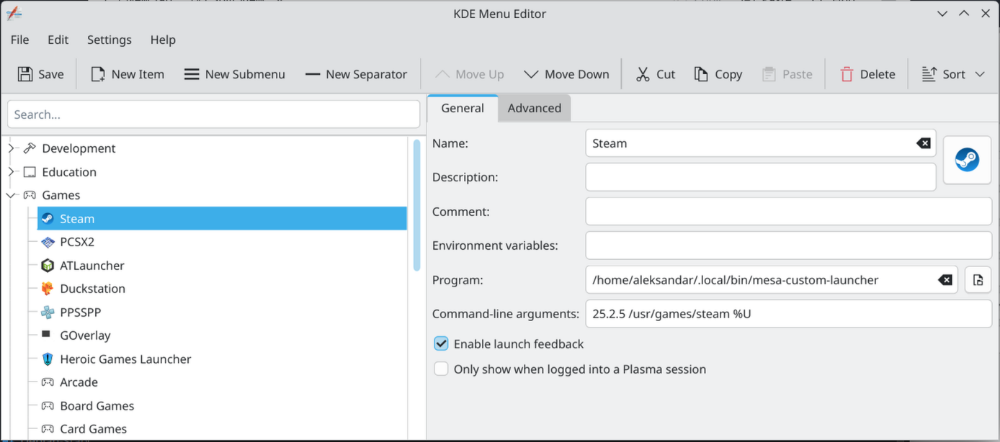

# To build `mesa` from source do this:
* Check prerequisites [here](https://docs.mesa3d.org/install.html)
* Download the release
* Unarchive the release and open it in a terminal
* Recommended: use `distrobox` to create a container (whether Debian/Fedora/openSUSE) to compile the source and then remove it in order not to bloat your main system with stuff that you don't need globally
* Recommended: if you are going to use [mesa-custom-launcher](https://github.com/AleksandarBayrev/mesa-custom-launcher) use the example compiling command to put the version in the correct folder (create `$HOME/.mesa-custom` if it does not exist beforehand)
* Enter the newly created container
* Install mesa build dependencies
* Run `meson setup builddir --libdir lib64 --prefix=$HOME/.mesa-custom/mesa-version -Dgallium-drivers=all -Dvulkan-drivers=all -Dgallium-rusticl=true -Dllvm=enabled -Dbuildtype=release` (change --prefix to your folder)
Example if compiling mesa 25.2.4: `meson setup builddir --libdir lib64 --prefix=$HOME/.mesa-custom/25.2.4 -Dgallium-drivers=all -Dvulkan-drivers=all -Dgallium-rusticl=true -Dllvm=enabled -Dbuildtype=release`
* Run `meson compile -C builddir` to compile it
* Run `meson install -C builddir` to install it to the prefix
* Exit the container
* Copy `./mesa-version` folder to `$HOME/.mesa-custom/mesa-version`
* Create a `mesa-run` bash script with the following content:
```bash
#!/bin/sh

MESA=$HOME/.mesa-custom/mesa-version \
LD_LIBRARY_PATH=$MESA/lib64:$MESA/lib:$LD_LIBRARY_PATH \
LIBGL_DRIVERS_PATH=$MESA/lib64/dri:$MESA/lib/dri \
VK_ICD_FILENAMES=$MESA/share/vulkan/icd.d/radeon_icd.x86_64.json:$MESA/share/vulkan/icd.d/radeon_icd.x86.json \
LIBVA_DRIVERS_PATH=$MESA/lib64/dri:$MESA/lib/dri \
VDPAU_DRIVER_PATH=$MESA/lib64/vdpau \
OCL_ICD_VENDORS=$MESA/etc/OpenCL/vendors/rusticl.icd \
    exec "$@"
```
Example for 25.2.4
```bash
#!/bin/sh

MESA=$HOME/.mesa-custom/25.2.4 \
LD_LIBRARY_PATH=$MESA/lib64:$MESA/lib:$LD_LIBRARY_PATH \
LIBGL_DRIVERS_PATH=$MESA/lib64/dri:$MESA/lib/dri \
VK_ICD_FILENAMES=$MESA/share/vulkan/icd.d/radeon_icd.x86_64.json:$MESA/share/vulkan/icd.d/radeon_icd.x86.json \
LIBVA_DRIVERS_PATH=$MESA/lib64/dri:$MESA/lib/dri \
VDPAU_DRIVER_PATH=$MESA/lib64/vdpau \
OCL_ICD_VENDORS=$MESA/etc/OpenCL/vendors/rusticl.icd \
    exec "$@"
```
* Copy it to `$HOME/.local/bin` (create the directory if missing)
* Add in `.bashrc` after all path updates the line `export PATH=$PATH:~/.local/bin`
* Use `mesa-run your-executable` to point to the newer `mesa`
* Or edit your application entries (for KDE an example with KDE Menu Editor):
